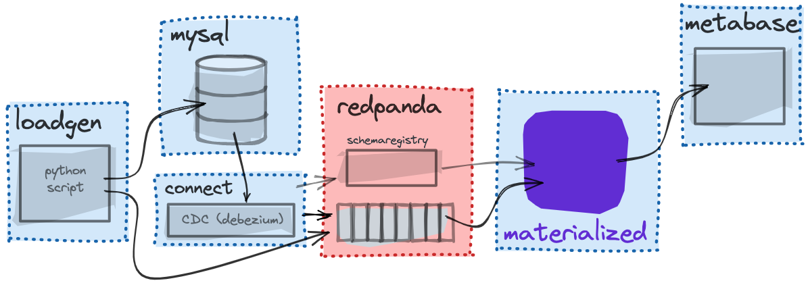

# Redpanda + Materialize Demo

This is a variation of the [standard ecommerce demo](../ecommerce), illustrating how it looks to switch from Kafka to Redpanda.



**NOTE:** For context on what is happening in the demo, and initial setup instructions, see the [README](https://github.com/MaterializeInc/ecommerce-demo#readme).

Before trying this out you will need the following:

- [Materialize Cloud account](https://materialize.com/register/).
- A publicly accessible Linux server with Docker installed.
- [`psql`](https://materialize.com/docs/integrations/sql-clients/#installation-instructions-for-psql) installed.

## Running Redpanda + Materialize Stack

You'll need to have [docker installed](https://materialize.com/docs/third-party/docker) before getting started.

1. Clone this repo and navigate to the directory by running:

   ```shell session
   git clone https://github.com/MaterializeInc/demos.git
   cd demos/ecommerce-redpanda
   ```

2. Copy the `.env.example` file to `.env` and set the `EXTERNAL_IP` variable to the IP address of your server.

   ```shell session
   cp .env.example .env
   export EXTERNAL_IP=$(hostname -I | awk '{print $1}')
   ```

3. Bring up the Docker Compose containers in the background.

   ```shell session
   docker compose up -d
   ```

   **This may take several minutes to complete the first time you run it.** If all goes well, you'll have everything running in their own containers, with Debezium configured to ship changes from MySQL into Redpanda.

4. Confirm that everything is running as expected:

   ```shell session
   docker compose ps
   ```

5. Exec in to the redpanda container to look around using redpanda's amazing [rpk]() CLI.

   ```shell session
   docker compose exec redpanda /bin/bash

   rpk debug info

   rpk topic list

   rpk topic create dd_flagged_profiles

   rpk topic consume pageviews
   ```

   You should see a live feed of JSON formatted pageview kafka messages:

   ```json
    {
        "key": "3290",
        "message": "{\"user_id\": 3290, \"url\": \"/products/257\", \"channel\": \"social\", \"received_at\": 1634651213}",
        "partition": 0,
        "offset": 21529,
        "size": 89,
        "timestamp": "2021-10-19T13:46:53.15Z"
    }
   ```

6. Connect to Materialize

If you already have `psql` installed on your machine, use the provided connection string to connect:

Example:

   ```shell session
   psql "postgres://user%40domain.com@materialize_host:6875/materialize"
   ```

Otherwise, you can find the steps to install and use your CLI of choice under [Supported tools](https://materialize.com/docs/integrations/sql-clients/#supported-tools).

7. Now that you're in the Materialize CLI, define the connection to the Redpanda broker and the schema registry:

    ```sql
    -- Create Redpanda connection
    CREATE CONNECTION redpanda_connection
      TO KAFKA
      BROKER '<your_server_ip:9092>';

    -- Create Registry connection
    CREATE CONNECTION schema_registry
      TO CONFLUENT SCHEMA REGISTRY
      URL '<your_server_ip:8082>';
    ```

8. Next, define all of the tables in `mysql.shop` as sources:

    ```sql
    CREATE SOURCE purchases
      FROM KAFKA CONNECTION redpanda_connection (TOPIC 'mysql.shop.purchases')
      FORMAT AVRO USING CONFLUENT SCHEMA REGISTRY CONNECTION schema_registry
      ENVELOPE DEBEZIUM
      WITH (SIZE = '3xsmall');

    CREATE SOURCE items
        FROM KAFKA CONNECTION redpanda_connection (TOPIC 'mysql.shop.items')
        FORMAT AVRO USING CONFLUENT SCHEMA REGISTRY CONNECTION schema_registry
        ENVELOPE DEBEZIUM
        WITH (SIZE = '3xsmall');

    CREATE SOURCE users
        FROM KAFKA CONNECTION redpanda_connection (TOPIC 'mysql.shop.users')
        FORMAT AVRO USING CONFLUENT SCHEMA REGISTRY CONNECTION schema_registry
        ENVELOPE DEBEZIUM
        WITH (SIZE = '3xsmall');
   ```

   Because the first three sources are pulling message schema data from the registry, materialize knows the column types to use for each attribute. The last source is a JSON-formatted source for the pageviews.

9. We'll also want to create a JSON-formatted source for the `pageviews`:

   ```sql
   CREATE SOURCE json_pageviews
    FROM KAFKA CONNECTION redpanda_connection (TOPIC 'pageviews')
    FORMAT BYTES
    WITH (SIZE = '3xsmall');
   ```

   With JSON-formatted messages, we don't know the schema so the [JSON is pulled in as raw bytes](https://materialize.com/docs/sql/create-source/json-kafka/) and we still need to CAST data into the proper columns and types. We'll show that in the step below.

   Now if you run `SHOW SOURCES;` in the CLI, you should see the four sources we created:

   ```sql
   materialize=> SHOW SOURCES;
       name
   ----------------
   items
   json_pageviews
   purchases
   users
   (4 rows)

   materialize=>
   ```

8. Next we will create a NON-materialized View, you can almost think of this as a reusable template to be used in other materialized view.

   ```sql
   CREATE VIEW pageview_stg AS
       SELECT
           *,
           regexp_match(url, '/(products|profiles)/')[1] AS pageview_type,
           (regexp_match(url, '/(?:products|profiles)/(\d+)')[1])::INT AS target_id
       FROM (
           SELECT
               (data->'user_id')::INT AS user_id,
               data->>'url' AS url,
               data->>'channel' AS channel,
               (data->>'received_at')::double AS received_at
           FROM (
               SELECT CAST(data AS jsonb) AS data
               FROM (
                   SELECT convert_from(data, 'utf8') AS data
                   FROM json_pageviews
               )
           )
       );
   ```

10. **Analytical Views:** Let's create a couple analytical views to get a feel for how it works.

   Start simple with a materialized view that aggregates purchase stats by item:

   ```sql
   CREATE MATERIALIZED VIEW purchases_by_item AS
        SELECT
            item_id,
            SUM(purchase_price) as revenue,
            COUNT(id) AS orders,
            SUM(quantity) AS items_sold
        FROM purchases GROUP BY 1;
   ```

   and something similar that uses our `pageview_stg` static view to quickly aggregate pageviews by item:

   ```sql
   CREATE MATERIALIZED VIEW pageviews_by_item AS
       SELECT
           target_id as item_id,
           COUNT(*) AS pageviews
       FROM pageview_stg
       WHERE pageview_type = 'products'
       GROUP BY 1;
   ```

   and now let's show how you can combine and stack views by creating a single view that brings everything together:

   ```sql
   CREATE MATERIALIZED VIEW item_summary AS
       SELECT
           items.name,
           items.category,
           SUM(purchases_by_item.items_sold) as items_sold,
           SUM(purchases_by_item.orders) as orders,
           SUM(purchases_by_item.revenue) as revenue,
           SUM(pageviews_by_item.pageviews) as pageviews,
           SUM(purchases_by_item.orders) / SUM(pageviews_by_item.pageviews)::FLOAT AS conversion_rate
       FROM items
       JOIN purchases_by_item ON purchases_by_item.item_id = items.id
       JOIN pageviews_by_item ON pageviews_by_item.item_id = items.id
       GROUP BY 1, 2;
   ```

   We can check that it's working by querying the view:

   ```sql
   SELECT * FROM item_summary ORDER BY pageviews DESC LIMIT 5;
   ```

   Or we can even check that it's incrementally updating by running a watch command via your `psql` shell right after the `SELECT` query above:

   ```sql
   \watch 1
   ```

11. **Views for User-Facing Data:**

    Redpanda will often be used in building rich data-intensive applications, let's try creating a view meant to power something like the "Who has viewed your profile" feature on Linkedin:

    User views of other user profiles

    ```sql
    CREATE MATERIALIZED VIEW profile_views_per_minute_last_10 AS
        SELECT
        target_id as user_id,
        date_trunc('minute', to_timestamp(received_at)) as received_at_minute,
        COUNT(*) as pageviews
        FROM pageview_stg
        WHERE
          pageview_type = 'profiles' AND
          mz_now() < (received_at*1000 + 600000)::numeric
        GROUP BY 1, 2;
    ```

    We can check it with:

    ```sql
    SELECT * FROM profile_views_per_minute_last_10 WHERE user_id = 10;
    ```

    and confirm that this is the data we could use to populate a "profile views" graph for user `10`.

    Next let's use a `LATERAL` join to get the last five users to have viewed each profile:

    ```sql
    CREATE MATERIALIZED VIEW profile_views AS
        SELECT
            target_id AS owner_id,
            user_id AS viewer_id,
            received_at AS received_at
        FROM (SELECT DISTINCT target_id FROM pageview_stg) grp,
        LATERAL (
            SELECT user_id, received_at FROM pageview_stg
            WHERE target_id = grp.target_id
            ORDER BY received_at DESC LIMIT 10
        );
    ```

    ```sql
    CREATE MATERIALIZED VIEW profile_views_enriched AS
        SELECT
            owner.id as owner_id,
            owner.email as owner_email,
            viewers.id as viewer_id,
            viewers.email as viewer_email,
            profile_views.received_at
        FROM profile_views
        JOIN users owner ON profile_views.owner_id = owner.id
        JOIN users viewers ON profile_views.viewer_id = viewers.id;
    ```

    We can test this by checking on profile views for a specific user:

    ```sql
    SELECT * FROM profile_views_enriched WHERE owner_id=25 ORDER BY received_at DESC;
    ```

11. **Demand-driven query:** Since redpanda has such a nice HTTP interface, it makes it easier to extend without writing lots of glue code and services. Here's an example where we use pandaproxy to do a ["demand-driven query"]().

    Add a message to the `dd_flagged_profiles` topic using curl and pandaproxy:

    ```curl
    curl -s \
    -X POST \
    "http://localhost:8082/topics/dd_flagged_profiles" \
    -H "Content-Type: application/vnd.kafka.json.v2+json" \
    -d '{
    "records":[{
            "key":"0",
            "value":"25",
            "partition":0
        }]
    }'
    ```

    Now let's materialize that data and join the flagged_profile id to a much larger dataset.

    ```sql
    CREATE SOURCE dd_flagged_profiles
        FROM KAFKA CONNECTION redpanda_connection (TOPIC 'dd_flagged_profiles')
        FORMAT BYTES
        WITH (SIZE = '3xsmall');

    CREATE MATERIALIZED VIEW dd_flagged_profile_view AS
        SELECT pageview_stg.*
        FROM dd_flagged_profiles
        JOIN pageview_stg ON user_id = btrim(text, '"')::INT;
    ```

    This pattern is useful for scenarios where materializing all the data (without filtering down to certain profiles) puts too much of a memory demand on the system.

12. Sink data back out to Redpanda:

    Let's create a view that flags "high-value" users that have spent $10k or more total.

    ```sql
    CREATE MATERIALIZED VIEW high_value_users AS
      SELECT
        users.id,
        users.email,
        SUM(purchase_price * quantity)::int AS lifetime_value,
        COUNT(*) as purchases
      FROM users
      JOIN purchases ON purchases.user_id = users.id
      GROUP BY 1,2
      HAVING SUM(purchase_price * quantity) > 10000;
    ```

    and then a sink to stream updates to this view back out to redpanda

    ```sql
    CREATE SINK high_value_users_sink
        FROM high_value_users
        INTO KAFKA CONNECTION redpanda_connection (TOPIC 'high-value-users-sink')
        FORMAT AVRO USING CONFLUENT SCHEMA REGISTRY CONNECTION 
        schema_registry
        ENVELOPE UPSERT
        WITH (SIZE = '3xsmall');
    ```

    We won't be able to preview the results with `rpk` because it's AVRO formatted. But we can actually stream it BACK into Materialize to confirm the format!

    ```sql
    CREATE SOURCE hvu_test
        FROM KAFKA CONNECTION redpanda_connection (TOPIC 'high-value-users-sink')
        FORMAT AVRO USING CONFLUENT SCHEMA REGISTRY CONNECTION schema_registry
        ENVELOPE DEBEZIUM
        WITH (SIZE = '3xsmall');

    SELECT * FROM hvu_test LIMIT 2;
    ```

## Conclusion

You now have materialize doing real-time materialized views on a changefeed from a database and pageview events from Redpanda. You have complex multi-layer views doing JOIN's and aggregations in order to distill the raw data into a form that's useful for downstream applications. In metabase, you have the ability to create dashboards and reports using the real-time data.

You have a lot of infrastructure running in docker containers, don't forget to run `docker compose down` to shut everything down!
