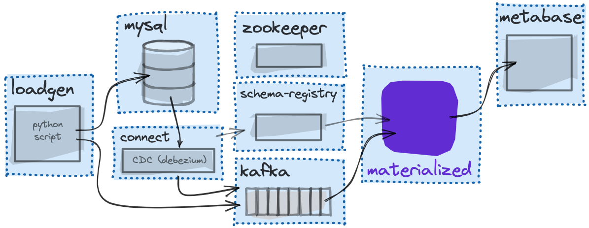

# Real-Time E-Commerce Demo

This app demonstrates the real-time incremental computation capabilities of Materialize in the context of an e-commerce website.

**An e-commerce business wants to understand:**

- **Order trends** throughout the day to discern patterns.
- **What is selling the most?**
  - Understand supply/demand and manage inventory.
  - Show inventory status in the website to encourage users to buy.
- **Conversion Funnel:** Effectiveness of the website in converting pageviews to actual buys.
- **Low-stock Alerts:** Generate alerts and automatically place orders to the warehouse if a specific item is close to running out of stock

We'll build materialized views that answer most of the questions by providing data in a [business intelligence dashboard](#business-intelligence-metabase).

To generate the data we'll simulate **users**, **items**, **purchases** and **pageviews** on a fictional e-commerce website.

To simplify deploying all of this infrastructure, the demo is enclosed in a series of Docker images glued together via Docker Compose. As a secondary benefit, you can run the demo via Linux, an EC2 VM instance, or a Mac laptop.

The [docker-compose file](docker-compose.yml) spins up containers with the following names, connections and roles:


## What to Expect

Our load generator (`loadgen`) is a [python script](loadgen/generate_load.py) that does two things:

1. It seeds MySQL with `item`, `user` and `purchase` tables, and then begins rapidly adding `purchase` rows that join an item and a user. _(~10 per second)_
2. It simultaneously begins sending JSON-encoded `pageview` events directly to kafka. _(~750 per second)_

As the database writes occur, Debezium/Kafka stream the changes out of MySQL to Confluent Cloud Kafka. Materialize subscribes to this change feed and maintains our materialized views with the incoming data––materialized views typically being some report whose information we're regularly interested in viewing.

For example, if we wanted real time statistics of total `pageviews` and orders by item, Materialize could maintain that report as a materialized view. And, in fact,
that is exactly what this demo will show.

## Prepping Mac Laptops

| **M1 Mac Warning**                                                                                                                                                          |
| --------------------------------------------------------------------------------------------------------------------------------------------------------------------------- |
| This demo relies heavily on Docker images from several different sources, we haven't tested it on Apple M1 Silicon yet, which is known to have Docker compatibility issues. |

If you're on a Mac laptop, you might want to increase the amount of memory
available to Docker Engine.

1. From the Docker Desktop menu bar app, select **Preferences**.
2. Go to the **Advanced** tab.
3. Select at least **8 GiB** of **Memory**.
4. Click **Apply and Restart**.

## Prerequisites

- Sign up for [Materialize](https://materialize.com/register)
- Create a Confluent Cloud account, you can sign up for a free account [here](https://www.confluent.io/confluent-cloud/tryfree/).
- Make sure you have [Docker](https://docs.docker.com/get-docker/) and [Docker Compose](https://docs.docker.com/compose/install/) installed.

## Running the Demo


1. Clone this repo and navigate to the directory by running:

   ```shell session
   git clone https://github.com/MaterializeInc/demos.git
   cd demos/ecommerce
   ```

2. Copy the `.env.example` file to `.env`:

   ```shell
   cp .env.example .env
   ```

3. Update the details in the `.env` file:

```
# Confluent Cloud Details
CONFLUENT_BROKER_HOST=
CONFLUENT_API_KEY=
CONFLUENT_API_SECRET=
CONFLUENT_SCHEMA_REGISTRY_URL=
CONFLUENT_SCHEMA_REGISTRY_API_KEY=
CONFLUENT_SCHEMA_REGISTRY_API_SECRET=
```

4. Go to your Confluent Cloud dashboard, and create the following topics:

- `mysql.shop.purchases`
- `mysql.shop.items`
- `mysql.shop.users`
- `pageviews`

> **Note**: If you don't create the topics, the demo will not work, and you will see the following error in the Debezium logs:
> `Error while fetching metadata with correlation id … : {<topic>=UNKNOWN_TOPIC_OR_PARTITION}`

Alternatively, you can set the `auto.create.topics.enable` option for your cluster to `true`, as described in the [Confluent documentation](https://docs.confluent.io/cloud/current/clusters/broker-config.html#change-cluster-settings-for-dedicated-clusters). This option is disabled by default, but once enabled, it will allow you to automatically create topics when they are referenced in a Kafka producer or consumer.

5. Bring up the Docker Compose containers in the background:

   ```shell session
   docker-compose up -d
   ```

   **This may take several minutes to complete the first time you run it.** If all goes well, you'll have everything running in their own containers, with Debezium configured to ship changes from MySQL into Confluent Cloud.

6. Connect to Materialize

If you already have `psql` installed on your machine, use the provided connection string to connect:

Example:

   ```shell session
   psql "postgres://user%40domain.com@materialize_host:6875/materialize"
   ```

Otherwise, you can find the steps to install and use your CLI of choice under [Supported tools](https://materialize.com/docs/integrations/sql-clients/#supported-tools).

7. In `psql`, start by securely storing your Confluent Cloud credentials for the Kafka cluster and Schema Registry as secrets:

    ```sql
    CREATE SECRET confluent_username AS '<your-username>';
    CREATE SECRET confluent_password AS '<your-password>';
    CREATE SECRET schema_registry_username AS '<your-username>';
    CREATE SECRET schema_registry_password AS '<your-password>';
    ```

8. Create the Kafka and Schema Registry connections:

    ```sql
    -- Create Kafka connection
    CREATE CONNECTION confluent_cloud
      TO KAFKA
      BROKER '<your_broker>',
      SASL MECHANISMS = 'PLAIN',
      SASL USERNAME = SECRET confluent_username,
      SASL PASSWORD = SECRET confluent_password;

    -- Create Registry connection
    CREATE CONNECTION schema_registry
      TO CONFLUENT SCHEMA REGISTRY
      URL '<your_schema_registry>',
      USERNAME = SECRET schema_registry_username,
      PASSWORD = SECRET schema_registry_password;
    ```
9. Now that you have your secrets and connections created, define all of the tables in `mysql.shop` as Kafka sources:

    ```sql
    CREATE SOURCE purchases
      FROM KAFKA CONNECTION confluent_cloud (TOPIC 'mysql.shop.purchases')
      FORMAT AVRO USING CONFLUENT SCHEMA REGISTRY CONNECTION schema_registry
      ENVELOPE DEBEZIUM
      WITH (SIZE = '3xsmall');

    CREATE SOURCE items
        FROM KAFKA CONNECTION confluent_cloud (TOPIC 'mysql.shop.items')
        FORMAT AVRO USING CONFLUENT SCHEMA REGISTRY CONNECTION schema_registry
        ENVELOPE DEBEZIUM
        WITH (SIZE = '3xsmall');

    CREATE SOURCE users
        FROM KAFKA CONNECTION confluent_cloud (TOPIC 'mysql.shop.users')
        FORMAT AVRO USING CONFLUENT SCHEMA REGISTRY CONNECTION schema_registry
        ENVELOPE DEBEZIUM
        WITH (SIZE = '3xsmall');
    ```

   Because these sources are pulling message schema data from the registry, Materialize knows the column types to use for each attribute.

10. We'll also want to create a JSON-formatted source for the `pageviews`:

   ```sql
   CREATE SOURCE json_pageviews
    FROM KAFKA CONNECTION confluent_cloud (TOPIC 'pageviews')
    FORMAT BYTES
    WITH (SIZE = '3xsmall');
   ```

   With JSON-formatted messages, we don't know the schema so the [JSON is pulled in as raw bytes](https://materialize.com/docs/sql/create-source/json-kafka/) and we still need to CAST data into the proper columns and types. We'll show that in the step below.

   Now if you run `SHOW SOURCES;` in the CLI, you should see the four sources we created:

   ```
   materialize=> SHOW SOURCES;
       name
   ----------------
   items
   json_pageviews
   purchases
   users
   (4 rows)

   materialize=>
   ```

11. Next, you can set up a [cluster](https://materialize.com/docs/sql/create-cluster) (logical compute) with one `xsmall` [replica](https://materialize.com/docs/sql/create-cluster-replica) (physical compute):

    ```sql
    CREATE CLUSTER ecommerce_demo REPLICAS (xsmall_replica (SIZE 'xsmall'));

    SET CLUSTER = ecommerce_demo;
    ```

12. Next, we will create our first (non-materialized) view:

   ```sql
   CREATE VIEW v_pageviews AS
    SELECT
        (data->'user_id')::int AS user_id,
        -- Extract pageview type and target ID from URL
        regexp_match(data->>'url', '/(products|profiles)/')[1] AS pageview_type,
        (regexp_match(data->>'url', '/(?:products|profiles)/(\d+)')[1])::int AS target_id,
        data->>'channel' AS channel,
        (data->>'received_at')::bigint AS received_at
    FROM (SELECT CONVERT_FROM(data, 'utf8')::jsonb AS data FROM json_pageviews);
   ```

   This view doesn’t store the results of the query, but simply provides an alias for the embedded `SELECT` statement and allows us to shape the pageview data into the format we need:

   1. We are converting the incoming data from raw bytes to [jsonb](https://materialize.com/docs/sql/types/jsonb/#main):

      ```sql
      SELECT CONVERT_FROM(data, 'utf8')::jsonb AS data FROM json_pageviews;
      ```

   2. We are using Postgres JSON notation (`data->'url'`), type casts (`::string`) and [regexp_match](https://materialize.com/docs/sql/functions/#string-func:~:text=regexp_match(haystack) function to extract only the item_id from the raw pageview URL.

      ```sql
      (regexp_match((data->'url')::string, '/products/(\d+)')[1])::int AS target_id,
      ```

13. Depending on your setup, in some cases you might want to use a [materialized view](https://materialize.com/docs/sql/create-materialized-view): a view that is persisted in durable storage and incrementally updated as new data arrives. We can use the `v_pageviews` view as a base to create a materialized view summarizing `pageviews` by item and channel:

   ```sql
   CREATE MATERIALIZED VIEW item_pageviews AS
    SELECT target_id AS item_id,
           channel,
           COUNT(*) as pageviews
    FROM v_pageviews
    WHERE pageview_type = 'products'
    GROUP BY item_id, channel;
   ```

   Now if you select from this materialized view, you should see data populating:

   ```sql
   SELECT * FROM item_pageviews ORDER BY pageviews DESC LIMIT 10;
   ```

   If you re-run this statement a few times, you should see the `pageview` counts changing as new data comes in and results get computed on the fly.

14. Let's create some more views:

   **Purchase Summary:**

   ```sql
   CREATE MATERIALIZED VIEW purchase_summary AS
       SELECT
           item_id,
           SUM(purchase_price) as revenue,
           COUNT(id) AS orders,
           SUM(quantity) AS items_sold
       FROM purchases
       GROUP BY item_id;
   ```

   **Item Summary:** _(Using purchase summary and pageview summary internally)_

   ```sql
   CREATE MATERIALIZED VIEW item_summary AS
       SELECT
           items.name AS item_name,
           items.category AS item_category,
           SUM(purchase_summary.items_sold) as items_sold,
           SUM(purchase_summary.orders) as orders,
           SUM(purchase_summary.revenue) as revenue,
           SUM(item_pageviews.pageviews) as pageviews,
           SUM(purchase_summary.orders) / SUM(item_pageviews.pageviews)::double AS conversion_rate
       FROM items
       JOIN purchase_summary ON purchase_summary.item_id = items.id
       JOIN item_pageviews ON item_pageviews.item_id = items.id
       GROUP BY item_name, item_category;
   ```

   This view shows some of the JOIN capabilities of Materialize. We're joining our two previous views with items to create a summary of purchases, pageviews, and conversion rates.

    Indexes assemble and incrementally maintain a query’s results updated in memory within a cluster, which speeds up query time:

    ```sql
    CREATE INDEX item_summary_idx ON item_summary (item_name);
    ```

   If you select from `item_summary` you can see the results in real-time:

   ```sql
   SELECT * FROM item_summary ORDER BY conversion_rate DESC LIMIT 10;
   ```

   **Remaining Stock:** This view joins items and all purchases created _after_ an item's inventory was updated, and creates a column that subtracts `quantity_sold` from the total `inventory` to get a live in-stock count.

   ```sql
   CREATE MATERIALIZED VIEW remaining_stock AS
       SELECT
         items.id AS item_id,
         MAX(items.inventory) - SUM(purchases.quantity) AS remaining_stock
       FROM items
       JOIN purchases ON purchases.item_id = items.id
        AND purchases.created_at > items.inventory_updated_at
       GROUP BY items.id;
   ```

   **Trending Items:** Here, we are doing a bit of a hack because Materialize doesn't yet support window functions like `RANK`. So instead we are doing a self join on `purchase_summary` and counting up the items with _more purchases than the current item_ to get a basic "trending" rank datapoint.

   ```sql
   CREATE MATERIALIZED VIEW trending_items AS
       SELECT
           p1.item_id,
           (
               SELECT COUNT(*)
               FROM purchase_summary p2
               WHERE p2.items_sold > p1.items_sold
           ) as trend_rank
       FROM purchase_summary p1;
   ```

   Lastly, let's bring the trending items and remaining stock views together to create a view that a user-facing application might read from:

   ```sql
   CREATE MATERIALIZED VIEW item_metadata AS
       SELECT
           rs.item_id as id, rs.remaining_stock, ti.trend_rank
       FROM remaining_stock rs
       JOIN trending_items ti ON ti.item_id = rs.item_id;
   ```

   Now if you run `SHOW VIEWS;` you should see all the views we just created:

   ```
   materialize=> SHOW VIEWS;
      name
   ------------------
   item_metadata
   item_pageviews
   item_summary
   purchase_summary
   remaining_stock
   trending_items
   (6 rows)
   ```

15. To see the results change in real-time let's use `SUBSCRIBE` instead of vanilla `SELECT`:

    ```sql
    COPY (
        SUBSCRIBE (
            SELECT * FROM trending_items
    )) TO STDOUT;
    ```

That's it! You've created some views that you can visualize in a BI tool like Metabase!

### Sink data back out to Kafka:

[Sinks](https://materialize.com/docs/sql/create-sink/) let you stream data out of Materialize, using either sources or views.

Let's create a view that flags "high-value" users that have spent $10k or more in total.

```sql
CREATE MATERIALIZED VIEW high_value_users AS
  SELECT
   users.id,
   users.email,
   SUM(purchase_price * quantity)::int AS lifetime_value,
   COUNT(*) as purchases
 FROM users
 JOIN purchases ON purchases.user_id = users.id
 GROUP BY 1,2
 HAVING SUM(purchase_price * quantity) > 10000;
```

and then a sink to stream updates to this view back out to Kafka:

```sql
CREATE SINK high_value_users_sink
   FROM high_value_users
   INTO KAFKA CONNECTION confluent_cloud (TOPIC 'high-value-users-sink')
   FORMAT AVRO USING CONFLUENT SCHEMA REGISTRY CONNECTION schema_registry
   ENVELOPE DEBEZIUM
   WITH (SIZE = '3xsmall');
```

Now if you go to the [Confluent Cloud UI](https://confluent.cloud/) and navigate to the `high-value-users-sink` topic, you should see data streaming in.

## Abandoned cart example

We can start simple with a materialized view that aggregates all users that have not completed a purchase:

```sql
CREATE MATERIALIZED VIEW incomplete_purchases AS
    SELECT
        users.id AS user_id,
        users.email AS email,
        users.is_vip AS is_vip,
        purchases.item_id,
        purchases.status,
        purchases.quantity,
        purchases.purchase_price,
        purchases.created_at,
        purchases.updated_at
    FROM users
    JOIN purchases ON purchases.user_id = users.id
    WHERE purchases.status = 0;
```

Next create a materialized view that contains all users that are no longer browsing the site:

> For the demo we would use 3 minutes as the idle time. But in a real world we could use a larger value like 30 minutes for example.

```sql
CREATE MATERIALIZED VIEW inactive_users_last_3_mins AS
    SELECT
        user_id,
        date_trunc('minute', to_timestamp(received_at)) as visited_at_minute
    FROM v_pageviews
    WHERE
    mz_now() >= (received_at*1000 + 180000)::numeric
    GROUP BY 1,2;
```

We can check that it's working by querying the view:

```sql
SELECT * FROM inactive_users_last_3_mins LIMIT 5;
```

Finally, we can create a materialized view that contains all incomplete orders for the inactive users:

```sql
CREATE MATERIALIZED VIEW abandoned_cart AS
    SELECT
        incomplete_purchases.user_id,
        incomplete_purchases.email,
        incomplete_purchases.item_id,
        incomplete_purchases.purchase_price,
        incomplete_purchases.status
    FROM incomplete_purchases
    JOIN inactive_users_last_3_mins ON inactive_users_last_3_mins.user_id = incomplete_purchases.user_id
    GROUP BY 1, 2, 3, 4, 5;
```

You can create a [Kafka SINK](https://materialize.com/docs/sql/create-sink/#kafka-sinks) or you can use [`SUBSCRIBE`](https://materialize.com/docs/sql/subscribe) to subscribe to the changes of the `abandoned_cart` view:

```sql
COPY (
    SUBSCRIBE (
        SELECT * FROM abandoned_cart
    )
) TO STDOUT;

## Business Intelligence: Metabase

1. In a browser, go to <localhost:3030> _(or <IP_ADDRESS:3030> if running on a VM)._

2. Click **Let's get started**.

3. Complete the first set of fields asking for your email address. This
   information isn't crucial for anything but does have to be filled in.

4. On the **Add your data** page, fill in the following information:

   | Field             | Enter...                        |
   | ----------------- | ------------------------------- |
   | Database          | **Materialize**                 |
   | Name              | **shop**                        |
   | Host              | **Your Materialize Host**       |
   | Port              | **6875**                        |
   | Database name     | **materialize**                 |
   | Database username | **user%40domain.com**           |
   | Database password | Your Materialize App Password. |

5. Proceed past the screens until you reach your primary dashboard.

6. Click **Ask a question**

7. Click **Native query**.

8. From **Select a database**, select **shop**.

9. In the query editor, enter:

   ```sql
   SELECT * FROM item_summary ORDER BY conversion_rate DESC;
   ```

10. You can save the output and add it to a dashboard, once you've drafted a dashboard you can manually set the refresh rate to 1 second by adding `#refresh=1` to the end of the URL, here is an example of a real-time dashboard of top-viewed items and top converting items:
    

## Send notifications to Telegram

Materialize is wire-compatible with PostgreSQL, so you can use any PostgreSQL client to connect to Materialize. In this example, we'll use [Node.js](/integrations/node-js) and the `node-postgres` library to create a script that pushes a message to Telegram when a user is inactive for 3 minutes and has incomplete purchases.

### Create a Telegram bot

1. Sign up for a [Telegram account](https://telegram.org/).
1. Next, create a bot on Telegram by talking to the `BotFather`.
1. Use the `/newbot` command to create a new bot, and follow the instructions to set a name and username for your bot.
1. The `BotFather` will give you a token that you will use to authenticate your bot. Keep this token safe, as it will allow anyone to control your bot.
1. Create a group on Telegram and add your bot to the group.
1. Get the group's chat ID, which you can obtain by using the `/getUpdates` method of the Bot API:

    ```bash
    curl https://api.telegram.org/bot<token>/getUpdates | jq '.result[0].message.chat.id'
    ```

### Create a Node.js script

1. Create a new directory for your project and install the [`node-telegram-bot-api`](https://www.npmjs.com/package/node-telegram-bot-api) package from `npm`:

    ```bash
    mkdir abandoned-cart-telegram-bot
    cd abandoned-cart-telegram-bot
    npm init -y
    npm install node-telegram-bot-api
    npm install pg
    ```

    The `node-telegram-bot-api` package provides an interface for the Telegram Bot API.

    The `pg` package is the official PostgreSQL client for Node.js, which we'll use to connect to Materialize.

1. Here is an example of how you might use the `node-telegram-bot-api` package to send a message to the Telegram group:

    ```javascript
    const TelegramBot = require('node-telegram-bot-api');

    const token = '<YOUR_TELEGRAM_BOT_TOKEN>';
    const chatId = '<YOUR_CHAT_ID>';

    const bot = new TelegramBot(token, {polling: true});

    bot.sendMessage(chatId, 'Hello, world!');

    console.log('Message sent');
    ```

    This code will send a message saying "Hello, world!" to the user or group with the specified chat ID.

    Let's expand this example to send a message to the Telegram group when a user abandons a cart.

1. Next, create a file called `index.js` and add the following code to it:

    ```javascript
    const TelegramBot = require('node-telegram-bot-api');
    const { Client } = require('pg');

    // Define your Telegram bot token and chat ID
    const token = '<YOUR_TELEGRAM_BOT_TOKEN>';
    const chatId = '<YOUR_CHAT_ID>';

    // Define your Materialize connection details
    const client = new Client({
        user: MATERIALIZE_USERNAME,
        password: MATERIALIZE_PASSWORD,
        host: MATERIALIZE_HOST,
        port: 6875,
        database: 'materialize',
        ssl: true
    });

    const bot = new TelegramBot(token, {polling: true});

    async function main() {
        // Connect to Materialize
        await client.connect();

        // Subscribe to the abandoned_cart view
        await client.query('BEGIN');
        await client.query(`
            DECLARE c CURSOR FOR SUBSCRIBE abandoned_cart WITH (SNAPSHOT = false)
        `);

        // Send a message to the Telegram group when a user abandons a cart
        while (true) {
            const res = await client.query('FETCH ALL c');
            if (res.rows.length > 0) {
                bot.sendMessage(chatId, JSON.stringify(res.rows));
            }
            console.log(res.rows);
        }
    }

    main();
    ```

   Run the script:

    ```bash
    node index.js
    ```

    Once you run the script, you will see the following output:

    ```javascript
    [
        {
            mz_timestamp: '1671102162899',
            mz_diff: '1',
            user_id: 1,
            email: 'test@test.com',
            item_id: 1,
            purchase_price: 2,
            status: 3
        },
        {
            mz_timestamp: '1671102162899',
            mz_diff: '1',
            user_id: 2,
            email: 'test2@test.com',
            item_id: 2,
            purchase_price: 3,
            status: 3
        }
    ]
    ```

    Each time a user abandons a cart, the script will send a message to the Telegram group.

## Conclusion

You now have Materialize doing real-time materialized views on a changefeed from a database and pageview events from Kafka. You have complex multi-layer views doing JOIN's and aggregations in order to distill the raw data into a form that's useful for downstream applications. In Metabase, you have the ability to create dashboards and reports based on this data.

You have som infrastructure running in Docker containers, so don't forget to run `docker-compose down` to shut everything down!
