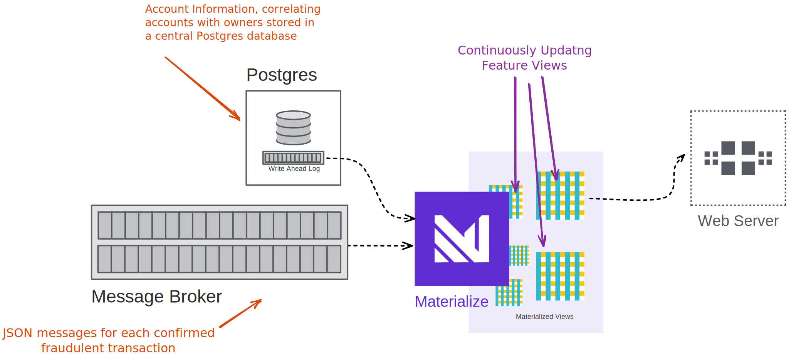

# Real-Time Feature Store with Materialize

This is a self-contained demo using [Materialize](https://materialize.com) to build a real-time feature store.
You can learn more about this demo by reading the corresponding [blog post](https://materialize.com/real-time-feature-store-with-materialize/).



## Running the demo

To spin up the demo, run:

```bash
docker-compose up -d
```

, and check that all services were started successfully:

```bash
docker-compose ps
```

You can make requests against the feature stores REST interface using cURL:

```bash
curl localhost:8100/vector/1
```

, or interact with Materialize directly via psql:

```bash
psql -h localhost -p 6875 materialize materialize
```

## Clean Up

When finished, you can quickly spin down the demo:

```bash
docker-compose down
```
